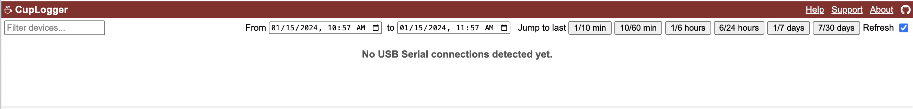
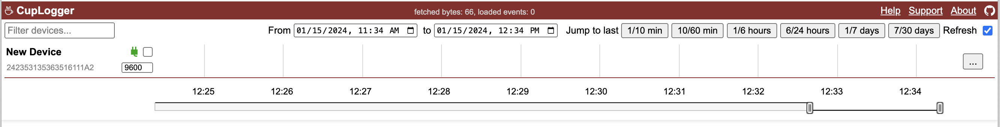
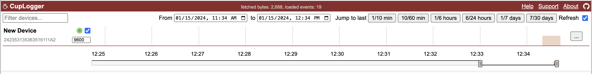
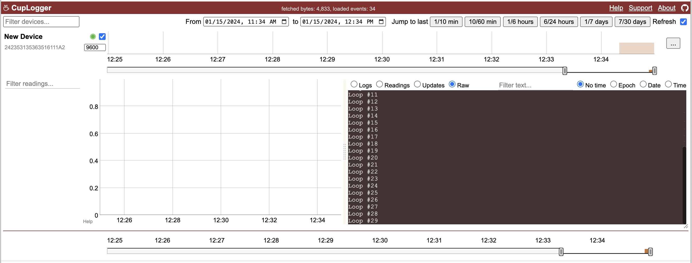
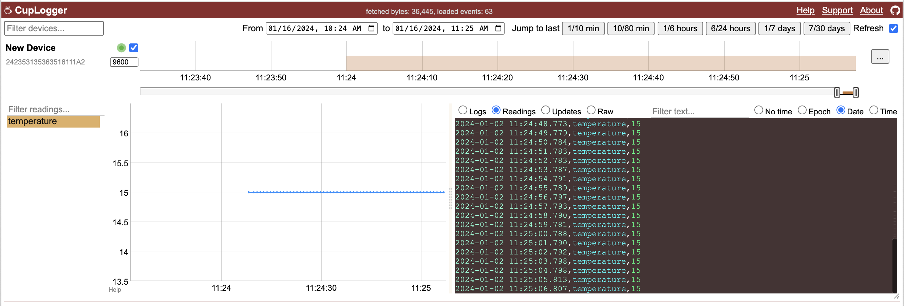

**CupLogger** is a tool to capture, store, and visualize logs and sensor readings from the Serial port, e.g. when working with microcontrollers such as Arduino or ESP32. [Distributed under the MIT License](#license).

At the very minimal, the tool captures the data from the Serial port into nicely organized files. You can then use your own scripts and tools (or provided UI and helper code in Python or Java) to work with the stored data. [jump to [Quick start: capture any data](#quickstart) to get started]


If you log data in a specific (CSV-like) format, there's a bit more functionality, such as plotting the readings. [jump to [Capture readings and logs](#capture_readings) to learn more]


Using CupLogger is great when you:

* need more convenient/better tool than Serial Plotter or Serial Monitor
* need to write data/logs from connected device via Serial into files, for later processing
* need to work with data across multiple devices (e.g. in projects which multiple microcontrollers), incl. connected at the same time
* need to work with data across number of runs/tests (to have data history)
* need a better way to organize and find the data captured across devices/runs and their configs.
* need to track changes in device/program evolution next to the data for easy correlation.

# <a name="quickstart"></a>Quick start: capture any data

Download the latest cuplogger-XXX.jar from [downloads](downloads/). It requires Java8+ to run and some disk space to store the data. If you don't have Java installed, you may follow https://www.oracle.com/java/technologies/java-se-glance.html.

To start the tool, run:
```commandline
java -jar cuplogger-0.9.jar start /tmp/base_dir 8080
```
Use the name & version of the jar that you downloaded. Replace `/tmp/base_dir` with the path to directory where you want to keep the data (it will be created if doesn't already exist). Change `8080` if you want to start web UI on a different port.

Once started, open your browser at http://localhost:8080 (use the port number you started it with). Note, that you can [avoid using web UI altogether](#config_control) by editing live connections configuration directly. 

If you haven't connected any devices it should look like this:



Once you connect a device, the tool will automatically "discover" (and "remember") it. If you haven't started capturing data you will see an empty timeline (hint: you can edit "New Device" name):



Let's assume the device is logging loop count, e.g. with Arduino program like this:

```C++
void setup() {
  Serial.begin(9600);
}

int i = 0;

void loop() {
  Serial.print("Loop #");
  Serial.println(i++);
  delay(1000);
}
```

Make sure the baud rate (`9600` in this example) is properly set to the one used in your program and check the checkbox to start capturing the data. You will start seeing that data is available on device's timeline:



If you don't see the data, make sure other programs using this serial port do not interfere (e.g. Arduino IDE's Serial Monitor should be closed). Similarly, sometimes you may want to pause capturing data by CupLogger (by un-checking the capture) when uploading new program to the device using the same serial port to let it succeed.

Expand device's details by clicking on "..." and browsing "Raw" captured data (not much else is available unless logs are better formatted, as described in [Capture readings and logs](#capture_readings)):



The captured logs can be accessed in the `data` folder in the directory you specified at startup, with each line prefixed by epoch timestamp of when it was received:

```text
base_dir
├── application.log
├── data
│   └── 2024_01_15
│       └── 242353135363516111A2
│           └── 2024_01_15_113426.txt
│                   > 1705318467715,Loop #0
│                   > 1705318468717,Loop #1
│                   > 1705318469720,Loop #2
│                   > 1705318470707,Loop #3
│                   > 1705318471715,Loop #4
│                   > 1705318472731,Loop #5
│                   ...
└── serialConnections.json
```
(hint: tail it with `tail -f /tmp/base_dir/data/*/*/*` command)

If you use **Python**, the provided [cuplogger.py](src/main/python/cuplogger.py) has handy methods to find and parse files for the given serial number and time range. See [example.py](src/main/python/example.py). Similarly, there's a helper code to do **Java**, see [ReadDataExample.java](src/main/java/example/ReadDataExample.java).

The following part describes how to make the most out of the logging by using a proper, CSV-like, format. Read on!

# <a name="capture_readings"></a>Capture readings and logs

To make CupLogger interpret log messages, sensor readings, device and program info, the serial data should follow a specific (though quite simple) format.  Here's an example program that records a `temperature` reading with value `15`:

```C++++
void setup() {
  Serial.begin(9600);
}

void loop() {
  Serial.println("MyProgram,1.0,DHT11,,,temperature:15,36");
  delay(1000);
}
```
(note: you may need to pause capturing data by CupLogger when uploading program via same port using Arduino IDE)

It also tells the program name (`MyProgram`) and program version (`1.0`), along with device config detail (`DHT11` to e.g. indicate the sensor type). The `36` at the end is used as a length-check (poor man's CRC) to help deal with quirks of Serial data transmits. The reading is now interpreted by the UI which can plot it:



(if you don't see the newly added `temperature` reading in the list try refreshing the web page).

Example of recording a simple log message `Setup is done!`:

```C++
void setup() {
  Serial.begin(9600);
  Serial.println("MyProgram,1.0,DHT11,,Setup is done!,35");
}
```

## Data Format

As you might've guessed, the data format is CSV-like:

```text
<programId>,<programVersion>,<deviceConfig>,<timeDelta>,<logMessage>[,<readingName>:<readingValue>[,<readingName>:<readingValue>[...]],<lengthCheck>
```

* `programId` (string) can be a name of your program (string)
* `programVersion` (string) can be a version of your program (string)
* `deviceConfig` (string) can contain device info
* `timeDelta` (numeric) can be a time passed since previous record (log or reading) as measured by device
* `logMessage` (string) can be a log message
* `[,<readingName>:<readingValue>[,<readingName>:<readingValue>[...]]` if present, is a list of readings 
  * `readingName` (string) is a reading name
  * `readingValue` (floating point) is a reading value
* `lengthCheck` (numeric) is length of the line up to (not including) the last comma

There's a lot of "can be" because it's up to you how you may want to use some of these. You can also skip them altogether (though don't skip the comma ;)). The "reading:value" format plays nicely with standard SerialPlotter, should you use it too.

NOTE: avoid commas in strings to avoid messing up the log structure.

### Example: Using lib to print out readings and logs

The provided [CupLogger lib](src/main/cpp/CupLogger) ([Arduino library zip](downloads/Arduino)) helps to log in proper format. The code would look like this (some examples [here](src/main/cpp/CupLogger/example)):

```C++
#include "CupLogger.h"

void setup() {
  Serial.begin(9600);
  logEnv("MyProgram,1.0,DHT11", millis); // optional
  log("Setup is done!");
}

void loop() {
  reading("temperature", 15);
  delay(1000);
}
```

Note this code specifies `millis()` as the source for the on-device time, to be used in logging the `timeDelta`. You can also specify `micros` or define your own (`unsigned long timeFunc() {...}`). 

The `logEnv("MyProgram,1.0,DHT11", millis);` line can be dropped altogether to use the defaults (empty strings and no time delta tracking). 

It should be easy to extend the [CupLogger](src/main/cpp/CupLogger) lib for your needs, or modify it to a non-Arduino environment (the only Arduino-specific methods using `Serial.print` are conveniently extracted). You can also just copy-paste the small lib code into your program as in [this sketch](src/main/cpp/CupLogger/example/sketch_lib_helpers_copied.ino). Or implement the simple helper functions yourself, as in the next example.

### Example: Custom helper functions to print out readings and logs

The format is quite simple, so you could just implement some simple helper functions to hide the format details yourself, e.g.:

```C++
char* logEnv = "MyProgram,1.0,DHT11,";

void log(const char* message) {
  int len = Serial.print(logEnv);
  len += Serial.print(","); // skipping timeDelta
  len += Serial.print(message);
  Serial.print(",");
  Serial.println(len);
}

void reading(const char* name, float value) {
  int len = Serial.print(logEnv);
  len += Serial.print(",,"); // skipping timeDelta and log message
  len += Serial.print(name);
  len += Serial.print(":");
  len += Serial.print(value);
  Serial.print(",");
  Serial.println(len);
}

void setup() {
  Serial.begin(9600);
  log("Setup is done!");
}

void loop() {
  reading("temperature", 15);
  delay(1000);
}
```

# Other usage details

## Start, stop, status

Apart from starting the CupLogger tool, there's a way to stop it and check its status. Usage:

```commandline
java -jar <program.jar> start <baseDir> <port>
java -jar <program.jar> status <baseDir>
java -jar <program.jar> start <baseDir>
```

## <a name="config_control"></a>Control data capture without web UI 

To control data capture without web UI you can edit its config file directly or use exposed HTTP API (e.g. with `curl`).

### Config file

Cuplogger tool keeps its live configuration in the `/tmp/base_dir` specified at the startup in the `serialConnections.json` file. It can look like this:

```json
{
  "242353135363516111A2": {
    "serialNumber": "242353135363516111A2",
    "vendorID": 9025,
    "productID": 67,
    "descriptivePortName": "IOUSBHostDevice",
    "systemPortName": "cu.usbmodem1101",
    "systemPortPath": "/dev/cu.usbmodem1101",
    "portDescription": "IOUSBHostDevice",
    "connected": false,
    "baudRate": 9600,
    "dataCaptureOn": true,
    "name": "New Device"
  },
  "48_27_E2_E9_9B_88": {...}
}
```

The file can be directly (manually or programmatically) edited, and the CupLogger tool will live reload it to reflect changes. If you want to control the data capture this way you are interested in `baudRate` and `dataCaptureOn` properties. When `dataCaptureOn` is `true`, CupLogger will start capturing the data from the Serial port where device with given serialNumber is connected using the specified `baudRate`.

## HTTP API

All POST requests must include a JSON body with the required parameters. Responses for all endpoints are formatted in JSON. Examples:
```commandline
curl -X POST -d '{}' http://localhost:8080/listSerialConnections
curl -X POST -d '{serialNumber:"242353135363516111A2", name:"My New Name"}' http://localhost:8080/setSerialConnectionName
curl -X POST -d '{serialNumber:"242353135363516111A2", baudRate:4800}' http://localhost:8080/setSerialConnectionBaudRate
curl -X POST -d '{serialNumber:"242353135363516111A2", dataCaptureOn:true}' http://localhost:8080/setSerialConnectionDataCapture
curl -X POST -d '{serialNumber:"242353135363516111A2", startEpochMs:1705500997739, endEpochMs:1705500997874}' http://localhost:8080/getData
```

#### List Serial Connections
- **Endpoint**: `/listSerialConnections`
- **Method**: POST
- **Description**: Retrieves a list of all known serial connections.
- **Response**: A list of serial connections in JSON format.

#### Set Serial Connection Name
- **Endpoint**: `/setSerialConnectionName`
- **Method**: POST
- **Description**: Sets the name for a specified serial connection.
- **Request Parameters**:
  - `serialNumber` (string): The serial number of the connection.
  - `name` (string): The new name to assign to the connection.
- **Response**: Confirmation of successful operation in JSON format.

#### Set Serial Connection Baud Rate
- **Endpoint**: `/setSerialConnectionBaudRate`
- **Method**: POST
- **Description**: Configures the baud rate for a specified serial connection.
- **Request Parameters**:
  - `serialNumber` (string): The serial number of the connection.
  - `baudRate` (integer): The baud rate to set.
- **Response**: Confirmation of successful baud rate change in JSON format.

#### Set Serial Connection Data Capture
- **Endpoint**: `/setSerialConnectionDataCapture`
- **Method**: POST
- **Description**: Enables or disables data capture for a specific serial connection.
- **Request Parameters**:
  - `serialNumber` (string): The serial number of the connection.
  - `dataCaptureOn` (boolean): `true` to enable data capture, `false` to disable.
- **Response**: Confirmation of the data capture status update in JSON format.

#### Get Data
- **Endpoint**: `/getData`
- **Method**: POST
- **Description**: Retrieves data from a specific serial connection for a given time range.
- **Request Parameters**:
  - `serialNumber` (string): The serial number of the connection.
  - `startEpochMs` (long): The start of the time range in milliseconds since epoch.
  - `endEpochMs` (long): The end of the time range in milliseconds since epoch.
- **Response**: Data collected from the specified serial connection within the given time range in JSON format.

## <a name="support"></a>Follow and support

Follow this project or [sensortea](https://github.com/sensortea) on github or [@sensortea](https://twitter.com/sensortea) on Twitter (X).

A great help is sharing what didn't work for you or what must be improved.

The best help is sharing if this project is useful, e.g. by starring it here on Github. You could also send a note to info_at_sensortea_dot_com.

# <a name="license"></a> License

This project is distributed under the MIT License. See the LICENSE file for more details.

Additionally, this project makes use of the following third-party libraries:
* jSerialComm: Licensed under the GNU Lesser General Public License v3.0 (LGPLv3).
* Gson: Licensed under the Apache License, Version 2.0.
* Dygraphs: Licensed under the MIT License.

Each library's respective license can be found in the [licenses](licenses) directory.

Copyright (C) 2024 Sensortea